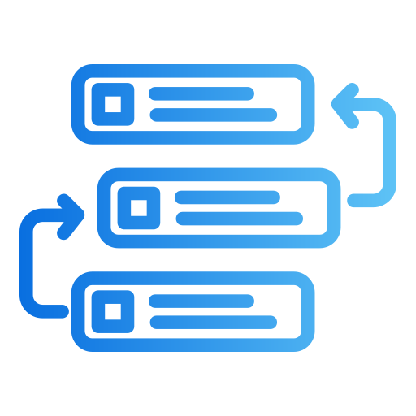

# Glosario de términos usados en el proyecto.

- Feature
  - Referido a una funcionalidad específica, comportamiento o capacidad de un sistema, aplicación o módulo que busca satisfacer
una necesidad del usuario o resolver un problema concreto. Se puede ver como un bloque fundamental que compone el valor entregado al
usuario.

- Requisito Funcional (RF)
  - Especificación que describe lo que un sistema debe hacer desde la perspectiva del usuario, este define funciones, comportamientos
  y capacidades que el sistema debe ofrecer para cumplir con las necesidades del usuario final.

- Requisito No Funcional (RNF)
  - Especificación que describe cómo debe comportarse un sistema, definiendo criterios de calidad, restricciones y propiedades que no se
  encuentran directamente relacionadas con funciones específicas, sin embargo, estas afectan la experiencia del usuario, rendimiento, seguridad
y mantenibilidad del software.

- Backlog
  - Lista priorizada de trabajo pendiente realizado en un proyecto de software, representa lo que se necesita construir, mejorar o corregir,
    organizado según la importancia y valor de las tareas.

  
  - Issue
    - Representa cualquier elemento que debe ser registrado, rastreado y resuelto durante el ciclo de vida del desarrollo, no necesariamente
    representa un error, igualmente puede representar una nueva funcionalidad solicitada.

  - Weekly
    - En el contexto de desarrollo de software, este se refiere a ritmos, ciclos o actividades que ocurren cada semana,
      este mismo es fundamental para la planificación, coordinación y entrega continua en equipos de desarrollo.

 

  - Bitácora
    - Registro cronológico que documenta el progreso, decisiones, incidentes y actividades relacionadas con un proyecto de software.
    
      

  - Feature Scope
    - Define límites, fronteras y especificaciones detalladas de una funcionalidad dentro de un proyecto de software. Este determina
      lo que está incluido y lo que queda fuera del trabajo a realizar.
      Este establece:
      - Qué se construirá
      - Cómo funcionará
      - Qué no se incluirá
      - Dependencias necesarias
      - Criterios de aceptación para considerar la feature completa

  - Revisión IA
    - Uso de inteligencia artificial para evaluar, analizar o mejorar diversos aspectos del desarrollo de software.
    
